```@meta
CurrentModule = MorrisonMilbrandt2015
```

# Gallery

The figures are written by `docs/generate_assets/generate_assets.jl`, which checks each against the
package values it shows: [`MM2015`](@ref) against the reference solution at every reference step,
event counts and times, and end states against the returned rates. Color marks the phase (liquid,
ice, and their sum) and line style the scheme throughout.

## Regimes at the start of a step

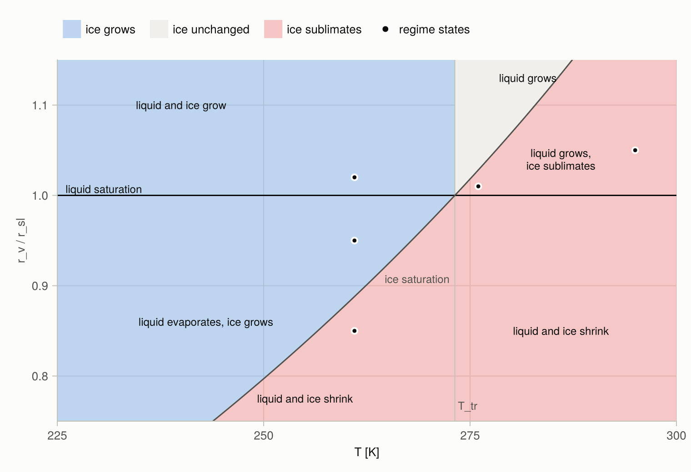

Sign of the ice rate at the start of a step (fill) at 800 hPa with 0.1 g kg⁻¹ of liquid and of ice
and no forcing, against temperature and the vapor mixing ratio relative to liquid saturation. Liquid
grows above the line ``r_v = r_{sl}`` and evaporates below it. Below the triple point
``T_\mathrm{tr}``, ice grows wherever the air is supersaturated over ice, including the band between
the two saturation curves where liquid evaporates onto the ice. Above ``T_\mathrm{tr}``, ice only
sublimates, below its saturation curve, which lies above liquid saturation there: between the two
curves liquid grows while ice sublimates. The dots are the five states below: 261 K at
``r_v/r_{sl}`` = 1.02, 0.95, and 0.85; 276 K at 1.01; and 295 K at 1.05.

## Five regimes

Each state has 0.1 g kg⁻¹ of liquid and of ice (no ice at 295 K), relaxation times of 10 s
(liquid) and 50 s (ice), and no forcing, at 800 hPa. The regime names the state at the start of the
step; within a step the parcel moves between regimes, and the schemes follow it through saturation
and exhaustion events.

The first figure of each pair shows the change of liquid, ice, and their sum over one step, for
steps from 1 s to an hour, on a symmetric logarithmic axis that is linear near zero. Dots are the
reference solution of the parcel model. The thin dash-dotted lines are the change at the rate of the
start of the step, and the thin solid lines the loss of all of a phase, ``-q``. The lower panel is
the difference of each scheme from the reference, relative to the larger of the reference liquid and
ice changes; a missing point is an exact match. The second figure follows one step: condensate,
supersaturation over liquid and over ice, and temperature, with a dot at each event.

### Supersaturated over liquid and ice

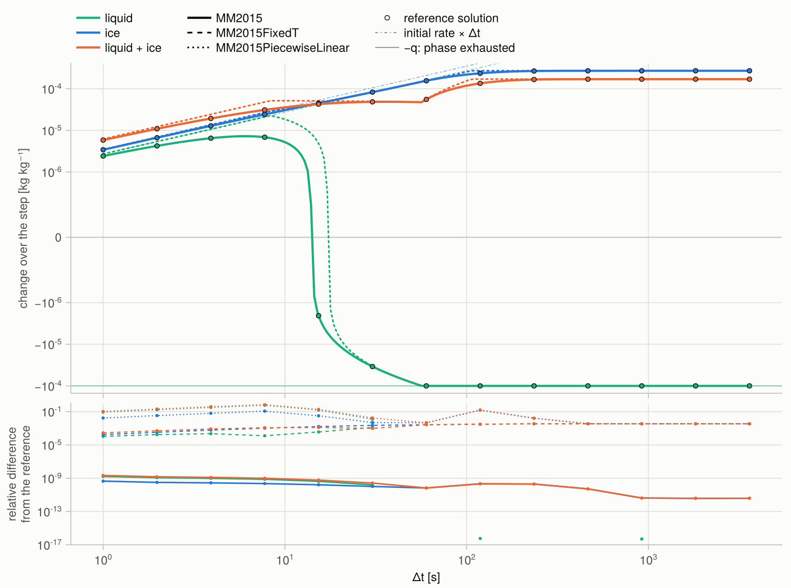

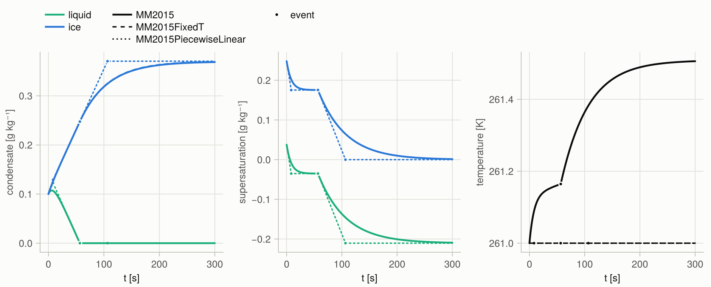

At 261 K and ``r_v/r_{sl}`` = 1.02 both phases grow. The ice draws the vapor below liquid
saturation within seconds, the liquid then evaporates onto the ice, and it is exhausted after 57 s.
The liquid change over the step therefore rises, turns, and ends at ``-q_l``.
[`MM2015PiecewiseLinear`](@ref) holds each rate until the next event and reaches the turn later.

### Between ice and liquid saturation


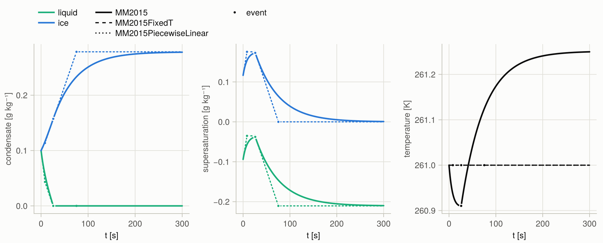

At ``r_v/r_{sl}`` = 0.95 the liquid evaporates onto the ice from the start and is exhausted after
26 s. The sum changes sign when the ice growth overtakes the loss of liquid. The evaporation cools
the parcel by 0.1 K before the deposition warms it.

### Subsaturated over liquid and ice

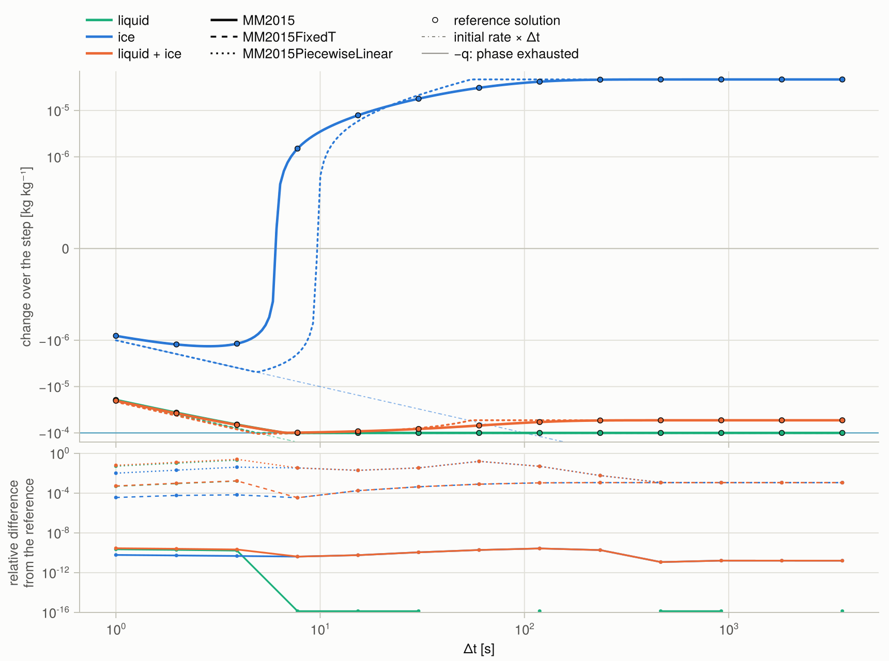

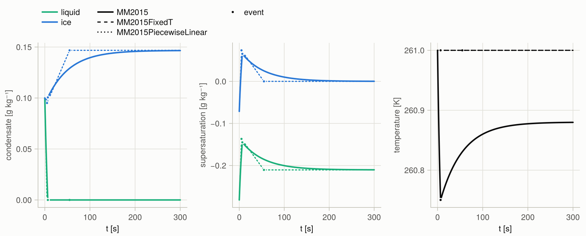

At ``r_v/r_{sl}`` = 0.85 both phases shrink at first. The liquid is exhausted after 7 s, and the vapor
it releases lifts the parcel above ice saturation: the ice turns from sublimating to growing, in
steps longer than 6 s. [`MM2015PiecewiseLinear`](@ref) holds each rate until the next event and
places the turn at 10 s.

### Above the triple point, between the saturations

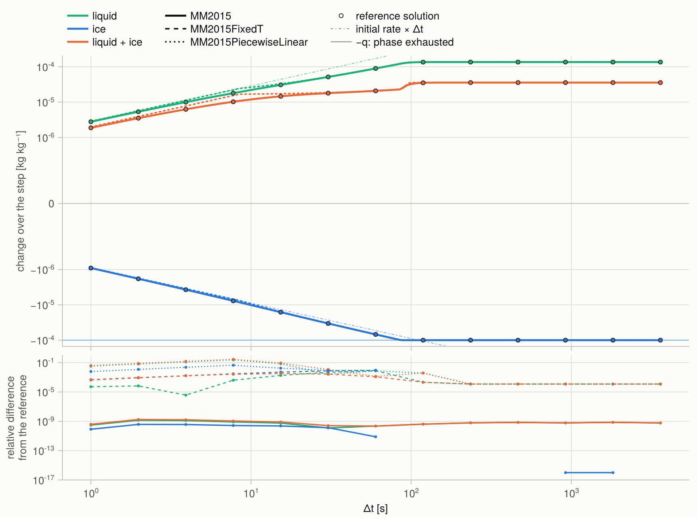

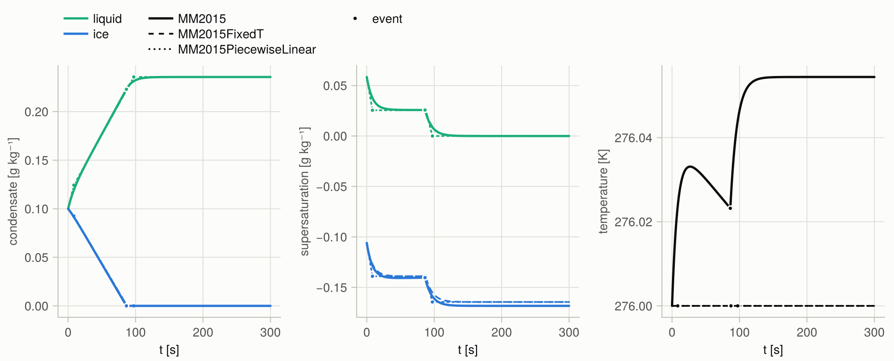

At 276 K and ``r_v/r_{sl}`` = 1.01 the air is supersaturated over liquid and subsaturated over ice:
the liquid grows while the ice sublimates, until the ice is exhausted after 86 s.

### Warm, supersaturated over liquid

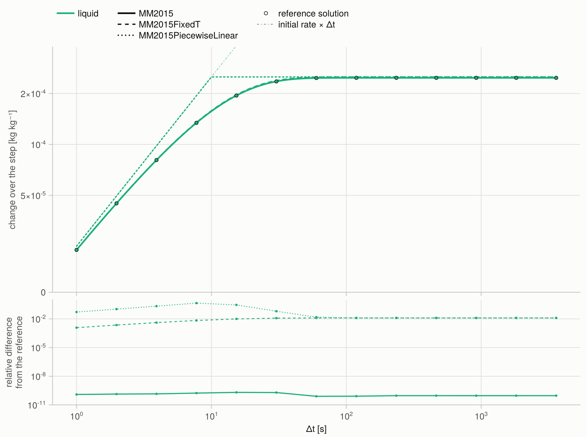

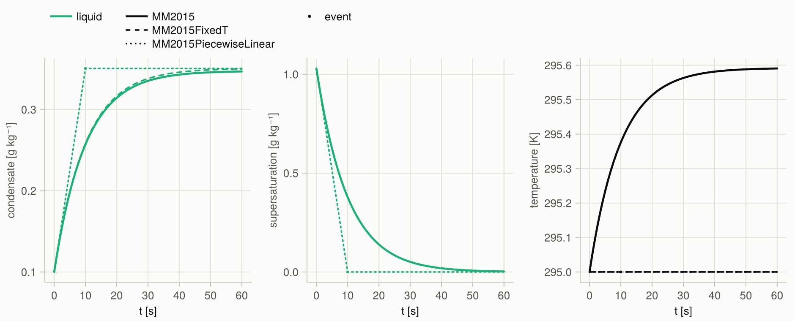

At 295 K and ``r_v/r_{sl}`` = 1.05 the liquid takes up a quarter of the excess vapor within a minute
and warms the parcel by 0.6 K. The warming raises the saturation humidity, which [`MM2015`](@ref)
follows; the frozen-coefficient schemes hold it at its start, and [`MM2015FixedT`](@ref) condenses
1.3 % more.

## Latent heating and the events

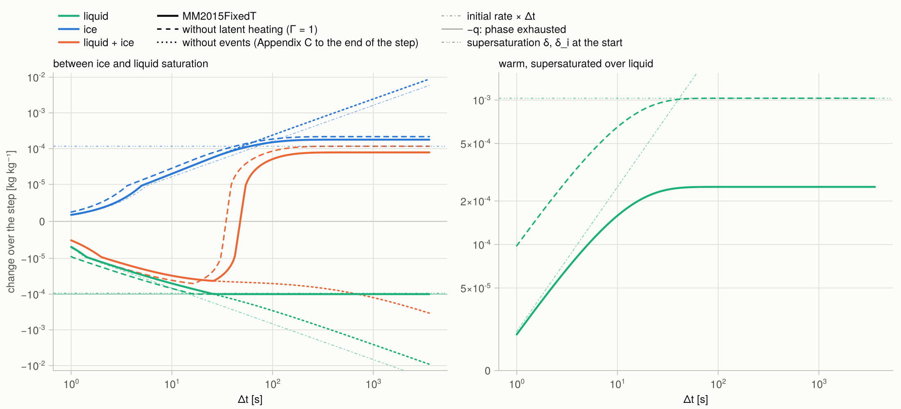

[`MM2015FixedT`](@ref) as computed (solid), with ``\Gamma_l = \Gamma_i = \alpha = 1`` (dashed), and
the Appendix C solution C5–C7 to the end of the step with the phases active at its start (dotted). The
thin dash-double-dotted lines are the supersaturations ``\delta`` and ``\delta_i`` at the start.
Without latent heating the warm parcel condenses its whole excess vapor ``\delta``; with it, the
latent heat raises the saturation humidity and the liquid takes up about ``\delta/\Gamma_l``.
Without events the liquid evaporates past its own mass and feeds the ice without bound, through the
term ``(q_{sl} - q_{si})/(\tau_i\Gamma_i)`` of C7; the exhaustion event stops the liquid at
``-q_l``.

## Forcing

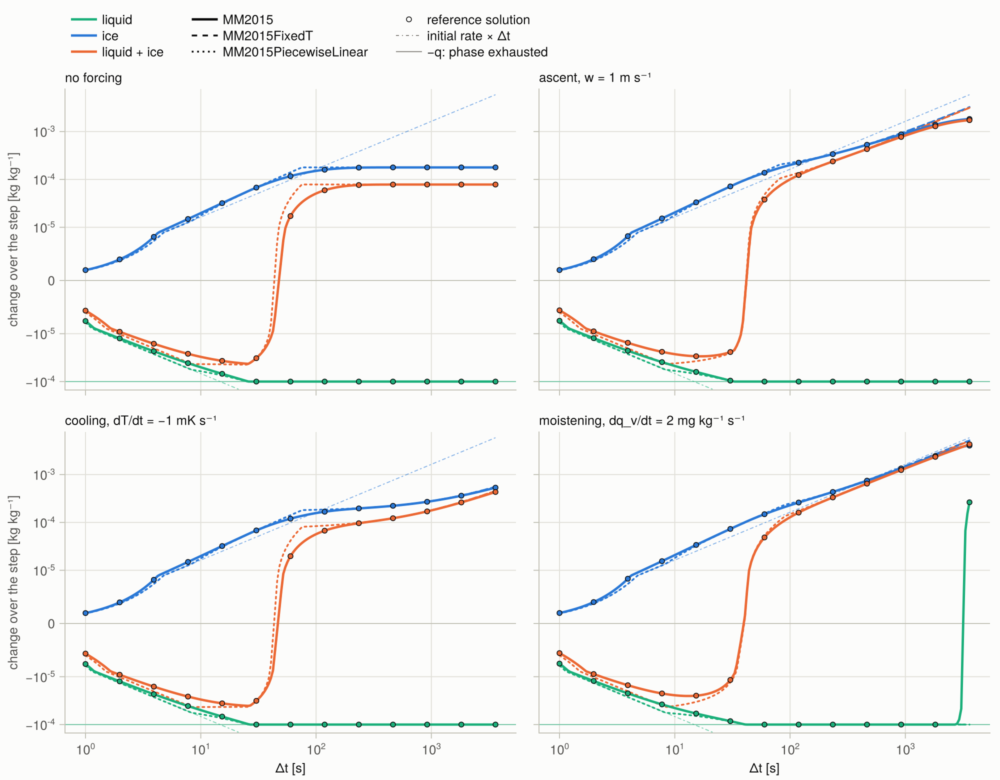

The state between ice and liquid saturation without forcing and with each of three forcings: ascent
at 1 m s⁻¹, cooling at 1 mK s⁻¹, and moistening at 2 mg kg⁻¹ s⁻¹. Each forcing keeps the ice
growing after the liquid is gone. Under moistening the deposition warms the parcel from 261 K to
273 K within the hour, which shrinks ``q_{sl} - q_{si}`` from 0.21 g kg⁻¹ to 0.04 g kg⁻¹ at 3300 s; the parcel
reaches liquid saturation after 2740 s and liquid forms again. [`MM2015`](@ref) and the reference
agree. The frozen-coefficient schemes hold ``q_{sl} - q_{si}`` at its start, and the supersaturation
over liquid settles at ``A_l\tau_i\Gamma_i/\alpha - (q_{sl} - q_{si}) = -0.11`` g kg⁻¹.

## The psychrometric factor

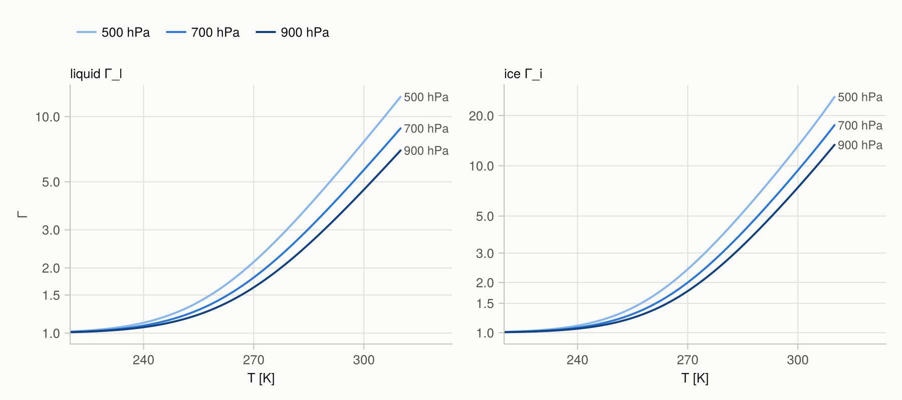

``\Gamma = 1 + (L/c_p)\,\partial q_s/\partial T`` over liquid and over ice at saturation and three
pressures. Each phase-change rate is divided by its ``\Gamma``: the latent heat released or taken up
changes the parcel temperature and with it the saturation humidity, which offsets part of the vapor
excess. ``\Gamma`` is close to 1 in cold air, reaches 4.5 to 7.5 over liquid at 300 K, and is larger
at lower pressure, where the saturation mixing ratio is larger.
