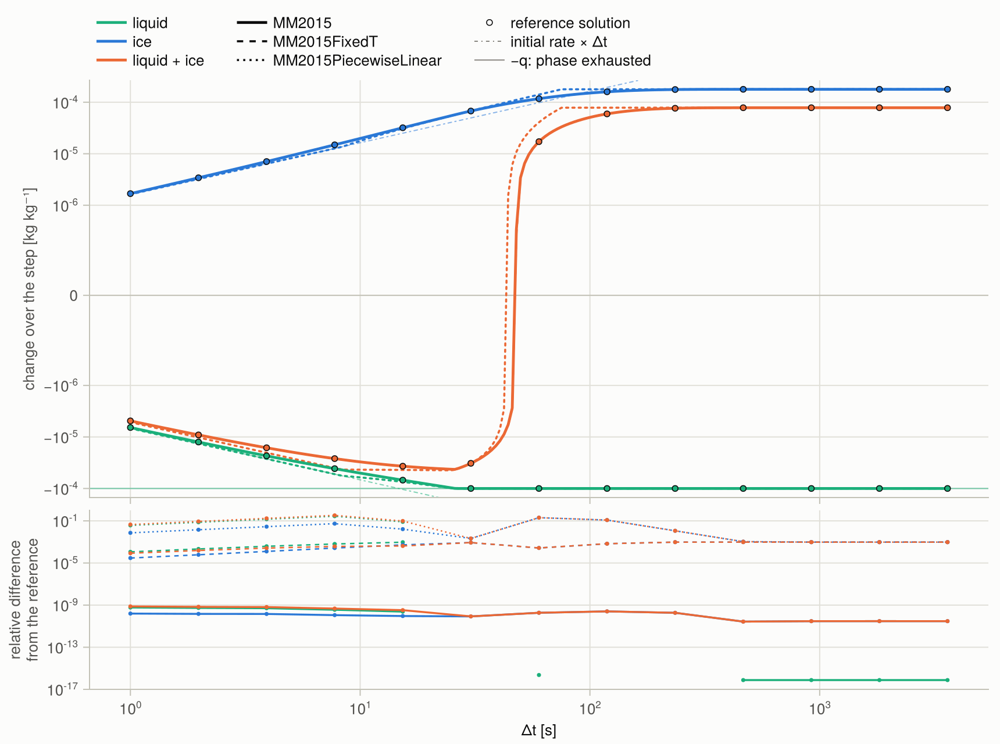
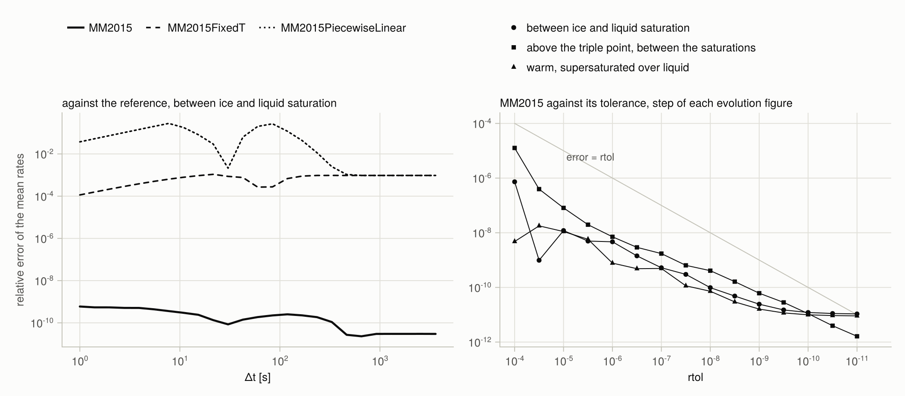
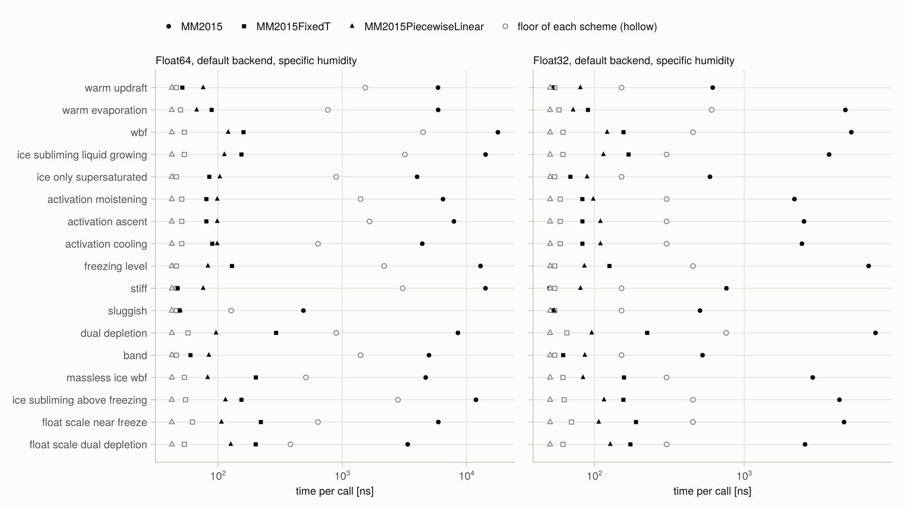

```@meta
CurrentModule = MorrisonMilbrandt2015
```

# MorrisonMilbrandt2015.jl

Condensation, evaporation, deposition, and sublimation of a homogeneous air parcel over a model time
step, after Appendix C of Morrison & Milbrandt (2015). Given the parcel's temperature, pressure,
humidities, the relaxation times of its liquid and ice, and the external forcing, the package returns
the mean phase-change rates of liquid and ice over the step, with the Wegener–Bergeron–Findeisen
exchange between them, the exhaustion of either phase, and activation from clear air.

| Scheme | Temperature | Work per call | Page |
|:--|:--|:--|:--|
| [`MM2015PiecewiseLinear`](@ref) | coefficients frozen at the step start; rates frozen per segment | arithmetic per segment, at most 14 segments | [MM2015PiecewiseLinear](schemes/piecewise_linear.md) |
| [`MM2015FixedT`](@ref) | coefficients frozen at the step start; the exact solution of Appendix C | one `expm1` per segment and a closed-form root per exhaustion, at most 9 segments | [MM2015FixedT](schemes/fixed_T.md) |
| [`MM2015`](@ref) | evolves; the parcel model solved to a tolerance | integrator steps, fewer at a looser tolerance | [MM2015](schemes/t_updating.md) |

Every call is free of allocations. [Performance](numerics/performance.md) has the measured times
and what they scale with.

## Quick start

```jldoctest quickstart
julia> using MorrisonMilbrandt2015

julia> problem = MM2015Problem(
           SpecificHumidity(),
           DefaultThermodynamicsBackend(),
           MM2015State(261.0, 8.0e4, 2.07e-3, 2.0e-4, 1.0e-4),  # T [K], p [Pa], q_t, q_l, q_i [kg kg⁻¹]
           MM2015Timescales(8.0, 60.0),                        # τ_liq, τ_ice [s]
           MM2015Forcing(-5.0, 0.0, 0.0),                      # dp/dt [Pa s⁻¹], dT/dt [K s⁻¹], dq_v/dt [s⁻¹]
       );

julia> validate(problem, 300.0)

julia> round.(tendencies(MM2015FixedT(), problem, 300.0); sigdigits = 3)
(-6.67e-7, 1.2e-6)

julia> round.(tendencies(MM2015(), problem, 300.0); sigdigits = 3)
(-6.67e-7, 1.21e-6)
```

The parcel sits between ice and liquid saturation at 261 K and rises at about 0.5 m s⁻¹. Its liquid
evaporates onto the ice and is exhausted after about 76 s, so the mean liquid rate over 300 s is
``-q_l/\Delta t``. [`trajectory`](@ref) returns the same step with its segments or integrator steps
recorded, and [`plot_evolution`](@ref) draws it after `using CairoMakie`.

The moisture variables follow the basis of the problem: [`SpecificHumidity`](@ref) (per unit mass
of moist air) or [`DryAirMixingRatio`](@ref) (per unit mass of dry air), and so do the returned
rates. The thermodynamics come from [`DefaultThermodynamicsBackend`](@ref) or, after
`using Thermodynamics`, from a `Thermodynamics.Parameters.ThermodynamicsParameters` set.

## What the schemes do



Change of liquid, ice, and their sum over one step against the step, for a parcel at 261 K between
ice and liquid saturation: the liquid evaporates onto the ice and is exhausted after 26 s, after
which its change is ``-q_l``. Dots are a reference solution of the parcel model; the lower panel is
the difference of each scheme from it. [`plot_step_change`](@ref) draws this figure. Five regimes,
latent heating, and forcing are in the [Gallery](gallery.md).



Left: relative error of the mean rates of each scheme against a Radau IIA solution of the parcel
model, as a function of the step, for the same state. [`MM2015`](@ref) stays below ``10^{-9}``;
[`MM2015FixedT`](@ref) differs by ``10^{-4}`` to ``10^{-3}`` and [`MM2015PiecewiseLinear`](@ref) by up
to 0.28. Right: the error of [`MM2015`](@ref) falls with its relative tolerance and stays below it.
More in [Validation](validation.md).



Time per call of each scheme on each test state, and the floor set by the transcendental functions
the call must evaluate ([Performance](numerics/performance.md)).

## Reference

Morrison, H., and J. A. Milbrandt, 2015: Parameterization of cloud microphysics based on the
prediction of bulk ice particle properties. Part I: Scheme description and idealized tests.
*J. Atmos. Sci.*, **72**, 287–311, doi:[10.1175/JAS-D-14-0065.1](https://doi.org/10.1175/JAS-D-14-0065.1).

```@contents
Pages = ["theory/parcel_model.md", "theory/appendix_c.md", "theory/moisture_bases.md", "schemes/fixed_T.md", "schemes/piecewise_linear.md", "schemes/t_updating.md", "numerics/events.md", "numerics/integrator.md", "depletion.md", "numerics/performance.md", "gallery.md", "validation.md", "api.md", "internals.md"]
Depth = 1
```
