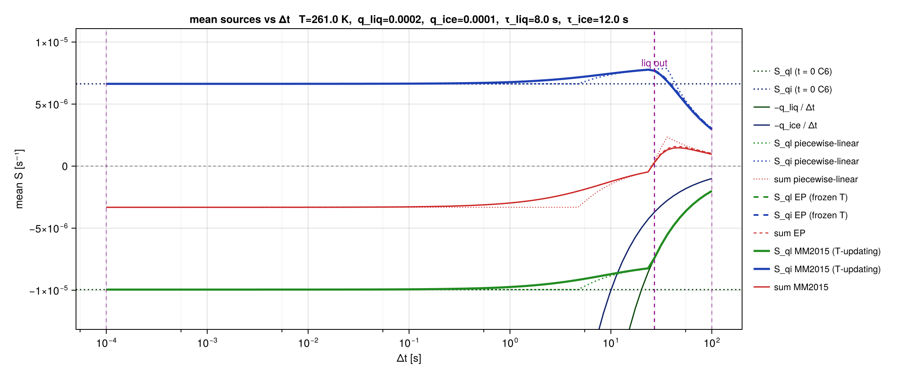
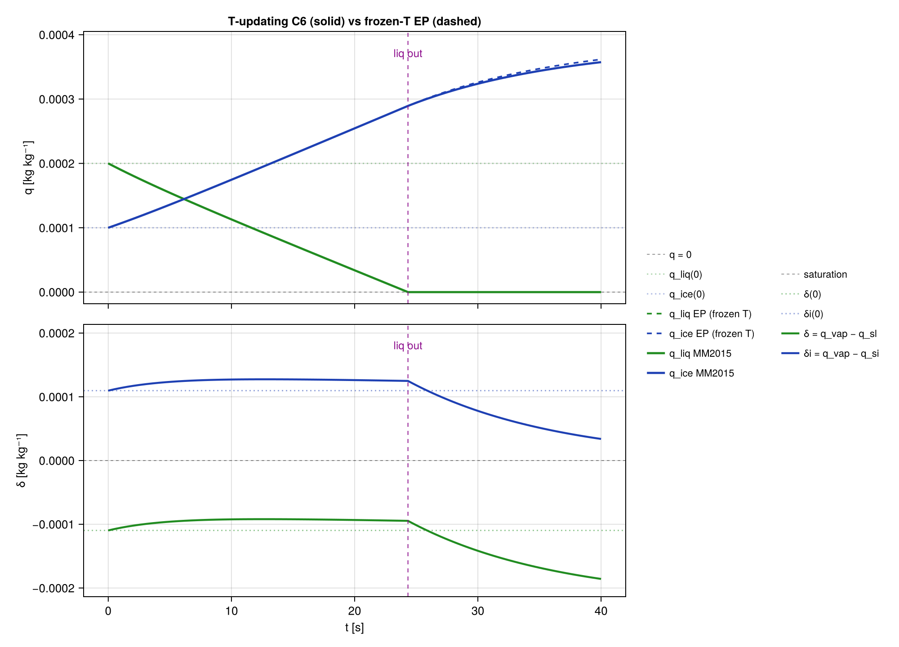

# MM2015 — *T*-updating Appendix C

[`MM2015`](@ref) applies frozen-coefficient **C6 mass** on each segment. Saturation and
freeze times are the **soonest** residual roots on the NonEquilibrium-updated state.

Solid: T-updating MM2015. Dashed: frozen-T EP (what Appendix C at fixed T does).
Dotted: piecewise-linear. Horizontal: `t=0` C6 (small-`Δt` target). Curves `−q/Δt`:
cannot remove more condensate than exists. When `S_ql` meets `−q_liq/Δt`, liquid is gone.

`using CairoMakie` implements [`plot_rates`](@ref), [`plot_evolution`](@ref),
[`plot_condensate`](@ref), [`plot_supersaturation`](@ref),
[`plot_specific_humidities`](@ref), and [`plot_temperature`](@ref).

At a trial time `t`:

1. Apply C6 at the current frozen `(A_c, τ, Γ, q_sl, q_si)` to get prognostic `q_liq(t)`, `q_ice(t)`.
2. `p(t) = p_0 − w ρ_0 g t`. That hydrostatic pressure in the invert **is** the adiabatic cooling; do not add `−w g / c_p` again to `T`.
3. Latent heat of this scheme's `S_ql`, `S_qi` is the condensate in `θ_li`; do not add `L S / c_p` again to `T`.
4. Host `dTdt` (radiation, mixing heat) is an entropy source:
   `θ_li(t) = θ_li(0) + (∂θ_li/∂T)_{p,q} dTdt t`, then `T(t)` from [`air_temperature_noneq_pθq`](@ref) at the new `p` and `q`.
   If `dTdt = 0`, `θ_li` is conserved on the segment. After a segment, `θ_li` is recomputed from the actual `(T, p, q)`.
5. `dqvdt` updates `q_tot` only. Extra vapor is a `δ` source; if that vapor also carries heat, the host passes `dTdt`.

Residuals:

- `F_δ(t) = q_v(t) − q_sl(T(t), …)`
- `F_δi(t) = q_v(t) − q_si(T(t), …)`
- `F_T(t) = T(t) − T_triple`

Default `θ_li` is Tripoli–Cotton; the invert is Lambert W₀. Thermodynamics.jl `pθ_li` is already algebraic.

## Mass: one liquid frame

When both phases are active, C6 is Appendix C as written (liquid-frame `A_c`, `τ`). Ice-frame C5 (`A_wbfI`, `τI`) is only a probe time `t_C5` for `F_δi`, not a mass-path switch. Single-species C6 when only one phase is active. Condensate out is Lambert (`_mm_smallest_depletion_time`), same conditions as [`ep_next_segment`](@ref).

## Leftmost residual root

The event time is the smallest `t ∈ (0, Δt]` with `F(t) = 0`, or `Inf` if none is detected. Same-sign `F(0)` and `F(Δt)` can still hide two crossings (hit saturation and leave). Three probes plus a solver on `[0, Δt]` is not the contract: Brent on a sign-changing `[0, Δt]` can return a later root, and same-sign endpoints are not “no root.”

**Phase A** — partition, then the leftmost sign change (same class as the depletion search):

1. Nudge `lo` if already on the surface.
2. Turning points: zeros of `F′` on `(lo, Δt]`. `F′` is the chain rule through C6 instantaneous rates, hydrostatic `p(t)`, `θ_li(t)`, the noneq invert, and `q_*` (default `q_*(T,p)`; Thermodynamics.jl `q_*(T,ρ)`). Probe `F′` at `{lo, t_C5, Δt}` (`t_C5` omitted if not in range). Adjacent pairs where `F′` changes sign are brackets for a turning point; Phase B solves `F′ = 0` there.
3. Ordered knots: `lo`, those turning points, interior `t_C5`, `Δt`. `t_C5` is a knot so a fast-`τ` event near `1e-12` is not jumped when `Δt = 10`. It is not an open iterate.
4. Walk knots left to right. The first adjacent pair with `F(a) F(b) ≤ 0` is the bracket of the soonest *detected* root. Phase B runs inside that pair only.
5. No such pair → `Inf`. No Secant. No “accept `|F|` small outside a bracket.”

If `F′` does not change sign on `{lo, t_C5, Δt}`, a turning point can be missed. The contract is the soonest *detected* root with that partition — not “`Inf` because the endpoints agree.”

**Phase B** — in-package Brent (the interpolant is discarded if it leaves `[a, b]`). FalsePosition and Bisection are bracketed alternatives. Unbracketed Newton/Secant are not the event finder. `using RootSolvers` adds Phase B methods (`BrentsMethod`, `NewtonsMethodAD`, …) behind `MM2015Solver{…}`; Newton AD starts at the bracket midpoint and is rejected if it leaves `[a, b]`.
