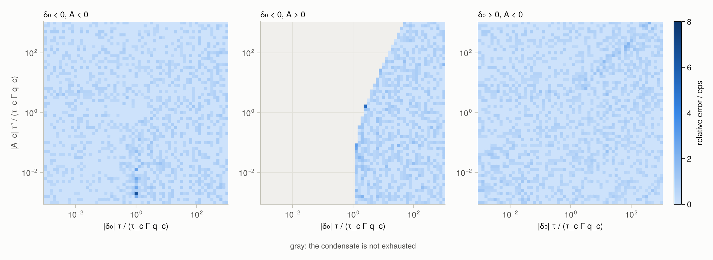

```@meta
CurrentModule = MorrisonMilbrandt2015
```

# Validation

## Reference solutions

The test suite solves the parcel model a second time with an independent integrator,
`test/reference/parcel_ode.jl`: Radau IIA of order 5 with a simplified Newton iteration on a
central-difference Jacobian, step-size control by step doubling, and events located by bisection on
the step map. It has two models.

- **Frozen-linear**: the state ``(\delta, q_l, q_i)`` under the [coefficients](theory/appendix_c.md)
  of the problem at the start of the step. This is the problem [`MM2015FixedT`](@ref) solves exactly
  and [`MM2015PiecewiseLinear`](@ref) approximates.
- **Nonlinear**: the [parcel model](theory/parcel_model.md) in the state ``(q_l, q_i, T)``, with the
  saturation humidities, latent heats, heat capacity, and density following the state. This is the
  problem [`MM2015`](@ref) solves.

The reference shares with the package only its thermodynamic functions; the frozen-linear model also
takes the coefficients. Depletion times are checked against roots computed in 256- and 512-bit
arithmetic.

## What the tests check

- [`MM2015FixedT`](@ref) against the frozen-linear reference: mean rates within ``10^{-10}`` of the
  larger rate (``10^{-12}`` measured on most states), and the same events at times within
  ``10^{-10}`` relative.
- [`MM2015`](@ref) against the nonlinear reference at a relative tolerance of ``10^{-10}``: mean
  rates within ten times the tolerance, the same events at times within ``10^{-7}`` relative, and the
  supersaturations at the end of the step; in both moisture bases, with both thermodynamics
  backends, and in `Float32` within ten times its default tolerance.
- The `exprb43` step at order 4 with fixed steps; the analytic Jacobian against finite differences;
  the ``\varphi``-functions against 512-bit values, within 8 times their componentwise condition
  number plus ``\varepsilon``.
- Depletion times over randomized inputs and near-tangent roots: within ``10^{-13}`` relative, or,
  where the root is ill-conditioned, with a residual within ``64\varepsilon`` of the size of the
  terms (the largest measured error is ``3.1\varepsilon``); and the Lambert ``W`` functions at their
  piece boundaries.
- Invariants on every test state and scheme: no phase loses more mass than it holds, a phase
  without mass never loses mass, and ice does not grow above the triple point in a step that does
  not cross it.
- Zero allocations and inferred return types for every scheme, moisture basis, floating-point
  type, and backend.

## Dependence on the step

The [Gallery](gallery.md) shows the change over one step of each scheme and of the reference for
steps from 1 s to an hour, in five regimes and under three forcings, with the difference of each
scheme from the reference.

## Accuracy


Left: relative error of the mean rates against the reference for the state between ice and liquid
saturation of the [Gallery](gallery.md), for steps from 1 s to an hour. [`MM2015`](@ref) stays
between ``2\times10^{-11}`` and ``6\times10^{-10}``, [`MM2015FixedT`](@ref) between ``1.1\times10^{-4}``
and ``1.1\times10^{-3}``, and [`MM2015PiecewiseLinear`](@ref) between ``10^{-3}`` and 0.28. Right: the error of
[`MM2015`](@ref) against its relative tolerance for three of the Gallery states, each over the step
of its evolution figure, with the line where the error equals the tolerance.

## Depletion times



Relative error of the exhaustion time of [`MM2015FixedT`](@ref), in units of ``\varepsilon``, against
256-bit roots, over the initial supersaturation ``\delta_0`` and forcing ``A_c`` in units of the
condensate. Gray marks where the condensate is not exhausted. The largest error on the grid is below
``8\varepsilon``.

## Test states

| Name | ``T`` [K] | ``p`` [hPa] | humidity | ``q_l``, ``q_i`` [g kg⁻¹] | ``\tau_l``, ``\tau_i`` [s] | forcing | ``\Delta t`` [s] |
|:--|--:|--:|:--|:--|:--|:--|--:|
| `warm_updraft` | 285 | 900 | ``r_v/r_{sl}`` = 1.001 | 0.2, 0 | 5, 1000 | w = 1 m s⁻¹ | 60 |
| `warm_evaporation` | 290 | 950 | ``r_v/r_{sl}`` = 0.9 | 0.01, 0 | 10, 1000 | — | 120 |
| `wbf` | 261 | 800 | ``r_v/r_{sl}`` = 0.995 | 0.2, 0.1 | 8, 60 | w = 0.5 m s⁻¹ | 300 |
| `ice_subliming_liquid_growing` | 275 | 850 | ``r_v/r_{sl}`` = 1.0005 | 0.1, 0.05 | 10, 20 | — | 120 |
| `ice_only_supersaturated` | 225 | 250 | ``r_v/r_{si}`` = 1.2 | 0, 0.01 | 1000, 600 | w = 0.2 m s⁻¹ | 600 |
| `activation_moistening` | 280 | 900 | ``r_v/r_{sl}`` = 0.999 | 0, 0 | 5, 1000 | ``\dot q_v`` = 2 mg kg⁻¹ s⁻¹ | 30 |
| `activation_ascent` | 280 | 900 | ``r_v/r_{sl}`` = 0.999 | 0, 0 | 5, 1000 | w = 1 m s⁻¹ | 30 |
| `activation_cooling` | 280 | 900 | ``r_v/r_{sl}`` = 0.999 | 0, 0 | 5, 1000 | ``\dot T`` = −1 mK s⁻¹ | 30 |
| `freezing_level` | 273.4 | 700 | ``r_v/r_{sl}`` = 1 | 0.1, 0.01 | 10, 100 | ``\dot T`` = −2 mK s⁻¹ | 300 |
| `stiff` | 280 | 900 | ``r_v/r_{sl}`` = 1.002 | 0.5, 0 | 0.1, 1000 | w = 2 m s⁻¹ | 60 |
| `sluggish` | 280 | 900 | ``r_v/r_{sl}`` = 1.01 | 0.001, 0 | 10⁴, 10⁴ | — | 10 |
| `dual_depletion` | 265 | 800 | ``r_v/r_{sl}`` = 0.8 | 0.001, 0.001 | 5, 20 | — | 120 |
| `band` | 261 | 800 | ``\delta`` = −10⁻⁷ | 0, 0.1 | 10, 50 | ascent in the band | 60 |
| `massless_ice_wbf` | 261.81 | 800 | halfway between saturations | 0.002, 0 | 10, 80 | — | 10 |
| `ice_subliming_above_freezing` | 276.77 | 900 | ``r_v/r_{sl}`` = 0.98 | 0, 0.7 | 6000, 4 | — | 10 |
| `float_scale_near_freeze` | 269.4 | 882.68 | ``\delta`` = −1.6·10⁻⁵ | 10⁻⁷, 4·10⁻⁸ | 80, 5·10⁵ | ``\dot T``, ``\dot q_v`` | 10 |
| `float_scale_dual_depletion` | 270.2 | 882.68 | ``\delta_i`` = −2.4·10⁻⁵ | 10⁻⁷, 10⁻⁷ | 80, 5·10⁵ | ``\dot T``, ``\dot q_v`` | 10 |

Humidities are ratios of the vapor mixing ratio to the saturation mixing ratio over liquid
(``r_{sl}``) or ice (``r_{si}``), or supersaturations in kg kg⁻¹. `band` rises at the speed that
places it in a narrow band of ascent in which the ice holds the air just below liquid saturation, so
no liquid forms. The two `float_scale` states warm at 0.28 mK s⁻¹ and moisten at 3.6 mg kg⁻¹ s⁻¹.
